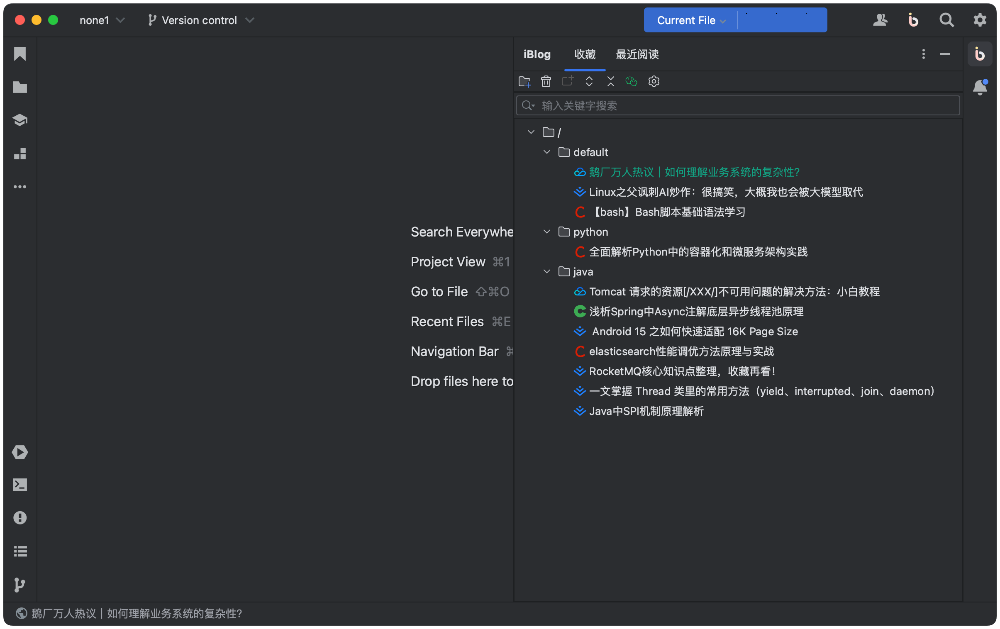

# iBlog-doc

## 插件开发群

## 简介
iBlog 是一款专注于提升用户技术水平的博客插件。无论您是在工作之余还是空闲时，iBlog 都能为您提供高质量的博客内容，
目前 iBlog 涵盖掘金、CSDN、腾讯开发者社区、OSCHINA等多个平台的精选文章。

> 累了困了闲了，来上一 **博** 吧！

## 功能与特点

- **随机一博：** 让您的工作之余提升自己，随机推荐符合您兴趣的博客文章。
- **阅读与收藏：** 您可以方便地阅读、搜索和收藏您喜欢的博客文章，并进行管理。
- **实时更新：** 定期更新最新的技术文章和行业动态，确保您始终站在技术前沿。

## 宗旨

* 学习新技术和趋势
* 提升专业技能
* 了解行业动态

## 功能

请在 Tools → iBlog 中根据自己的需求选择相应的节点

## 操作步骤
1. 菜单栏 Tools -> iBlog 配置博客源
2. 右上角点击 iBlog 图标
3. 在 iBlog 工具窗口查看并收藏自己喜欢的博客
4. 在收藏列表管理收藏的博客
5. 双击博客条目打开博客

